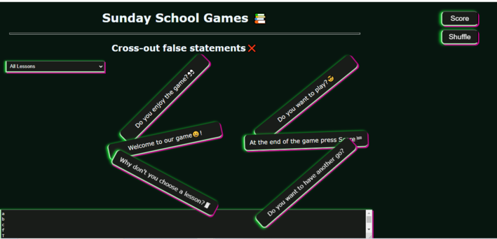

# Sunday School Games

## Team Members

- [Voichita Maria Truscai](https://github.com/sabovoichita)
- [Denisa Puie](https://github.com/dpuie)

## demo [live link](https://sabovoichita.github.io/sunday-school-cross-out-game/)

## Description

- The current project is intended to be an application where children can deepen the knowledge obtained during the Sunday School lessons.
- We used HTML to establish the structure, CSS to define the style and layout and through JAVA SCRIPT and JSON the page and, implicitly, its content became much more interactive.
- Children will be able to check their knowledge by underlining the incorrect statements by clicking on the incorrect sentences. At the end of testing, the SCORE button will create an alert that provides the results of the game along with a short motivational message.
- From the section All Lessons, different lessons can be selected, depending on the category of children who will access the page, with sentences that will contain different statements depending on the lesson studied. They will work based on the principle presented above.
- The function createDifferentDomains1 will be used to add more lessons in the future, covering an entire year's curriculum.

## Descriere

- Proiectul de față se vrea a fi o aplicație în care copiii pot aprofunda cunoștințele obținute pe parcursul lecției de la Școala Duminicală.
- Am folosit HTML pentru a stabili structura, cu ajutorul CSS-ului am definit style-ul și layout-ul iar prin intermediul JAVA SCRIPT și JSON pagina și, implicit, conținutul acesteia au devenit mult mai interactive.
- Copiii își vor putea verifica cunoștințele prin sublinierea afirmațiilor incorecte, cu ajutorul unui CLICK pe propozițiile gresite. La finalul testării, butonul SCORE va crea un alert care oferă rezultatele jocului alături de un scurt mesaj motivațional.
- Din zona All Lessons se pot selecta diferite lecții, in funcție de categoria de copiii ce vor accesa pagina, cu propoziții ce vor conține diferite afirmații in funcție de lecția studiată. Acestea vor funcționa pe baza principiului prezentat mai sus.
- Funcția createDiferentDomains1 va fi folosită pentru a adăuga mai multe lecții pe viitor, care vor acoperi curriculumul unui an întreg.
